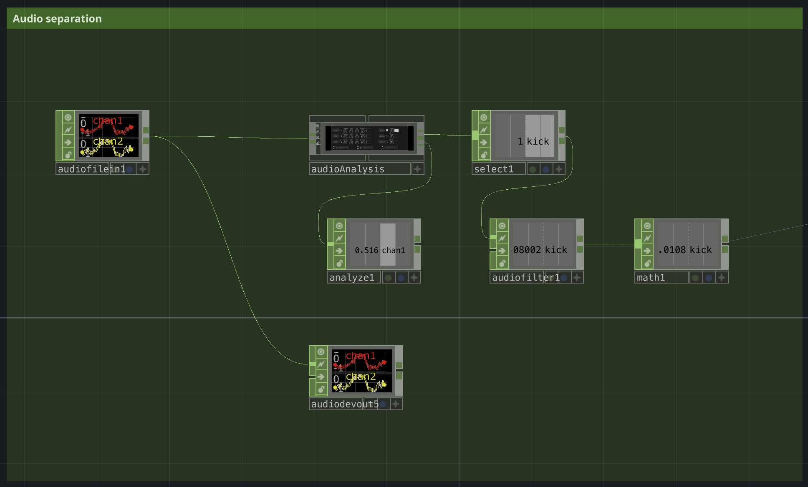
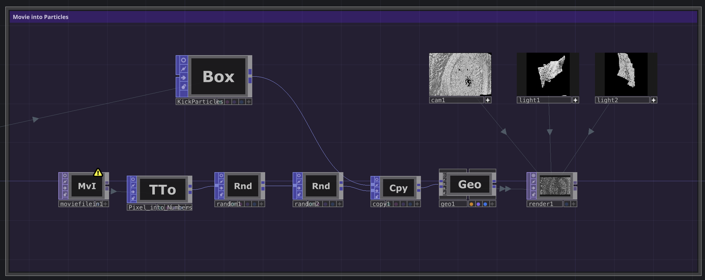
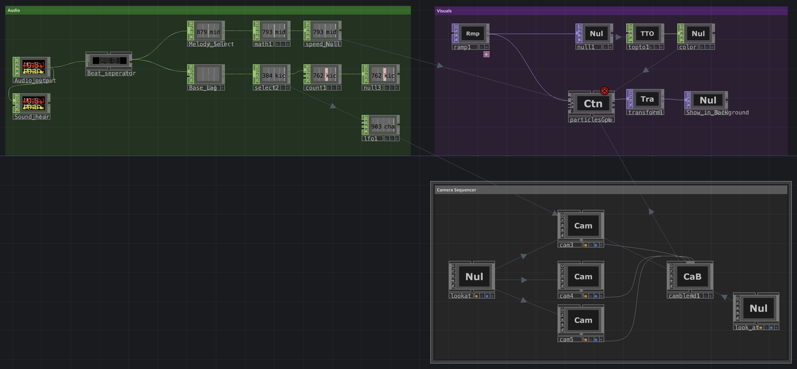
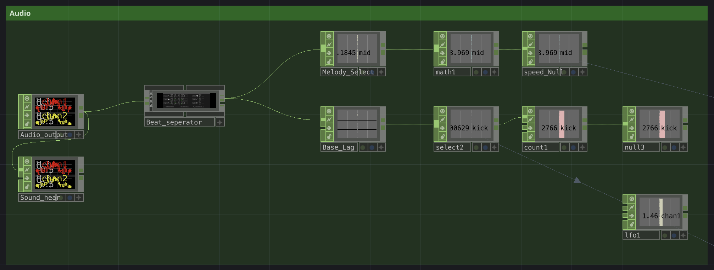
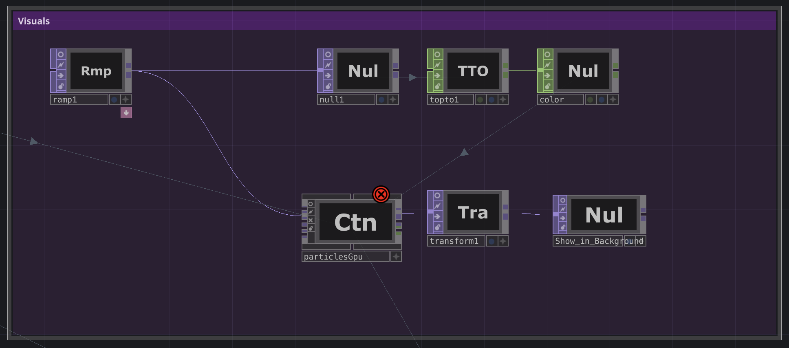
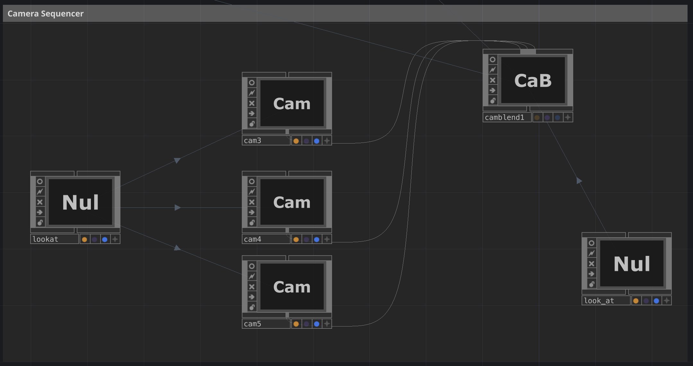

# Documentation_CreativeTechnology_Team_Macher

## About

 Our project is a **sound-reactive music animation** designed to create an immersive, drifting experience. The visuals respond in real time to the music, turning sound into movement, light, and form. Instead of watching a fixed animation, the audience enters a living audiovisual space that constantly changes with the audio.

The goal is to create a floating, meta-universe–like atmosphere that makes viewers feel as if they are leaving the physical room and slipping into another world. The experience is meant to be calming, hypnotic, and slightly surreal—somewhere between being awake and dreaming.

A key part of our visual identity is the use of eyes. The eyes act as a recurring visual motif that gives the world a sense of presence, awareness, and connection. They make the environment feel alive, as if it is observing and reacting to the sound together with the audience.

The animation is intended to be experienced while sitting or lying down, allowing the body to relax and the focus to shift fully toward sound and visuals. Music drives the entire environment: rhythm, volume, and texture influence how elements move, pulse, and transform, so the audience can not only hear the music but also see and feel it.

Overall, the project explores how sound and visuals merge into one immersive space, creating a unique journey where every piece of music generates a new, floating visual world.

[Video] (videolink)

---

## Usage

**Hardware:**
- MacBook Pro (Apple M2 Pro)
- Mixer Console (Audio Tech) 
- Projector

**Softwares**
- Touchdesigner (Version 2025.31310, non-commercial)
- Mireilles music shit

**Connection scheme**
Music - Mixer - Stem separator - Touchdesigner - Projector

**Communication Diagram**
@mireille pls do schnell mitem DJ set und Beamer ufschribe was wohere wie im bispil cause IDK lol

---

### Stem Separation

### Project Eyevisual

#### Description Project Eyevisual

This Project transforms a video into a particle system. Each pixel of the video becomes a particle and the movement of these particles is influenced by audio specifically by detecting the low frequencies of the music.

#### Requirements

Software:
- Touchdesigner
- A video file (.mp4)
- An audio file (.mp3)

#### Instructions

The whole project is separated into two main sections:
- Audio separation (green Area)
- Movie into Particles (purple Area)

**Audio separation**

Create a new Touchdesign file and copy the CHOPs in the Screenshot below.

1. audiofilein
- Insert .mp3 in "File"
- Loads and plays the audio
- Outputs two audio channels

2. Beat separator (Is not a Chop insert from Palette -> Tools)
- Enable "Kick" and adjust the Thresh
- Analyzes the incoming audio signal
- Extracts frequency information

3. select
- in Dropdown Channel names choose "kick"
- Selects the low frequency band labeled "kick"
- This isolates the beat of the music

4. audiofilter
-  Smooths the kick signal.
Prevents jittery or unstable motion in visuals.

5. math
- Remaps and scales the kick values
- Ensures the values are usable for controlling particle movement.

6. audiodevout
- Sends the audio to the speakers to test and hear the sound

**Video into particle conversion**

Continue by copying the TOPs and CHOPs in the Screenshot below.

1. moviefilein
- Insert .mp4 in "File"
- Loads a video file
- Each frame of the video is used as visual source data.

2. topto (TOP -> CHOP)
- change "First RGBA Contains" dropdown into: "Height (R)"
- Converts pixel data from the video into numeric values.
- These values later define particle positions.

3. random1 & random2
- Adds variation to particle positions.
- Prevents particles from forming a rigid grid.

4. Box (KickParticles)
- Connect the Node "Math" from the audioseparation into the Box **parameter** "Uniform Scale"
- Acts the base geometry
- Receives influence from the audio kick signal.
- This causes: Strong beats -> stronger particle movement. Quiet sections -> calmer visuals

5. copy
- Copies geometry points.
- Creates a particle like structure from data

6. geo (COMP)
- Combines geometry and particle data.
- Receives audio driven values that affect movement.

7. render
- Renders the Scene
- This will be the final visual output

8. cam, light1, light2 (COMPs)
- Connect these Comps to the Render
- Define camera perspectives and lightings
- Improve depth and readability of the particle system.

---

### Project DancingParticles

#### Description Project DancingParticles

This project displays a 3D particle cloud that reacts to music in real time. The high frequencies of the audio control the speed and motion of the particles, while the low frequency beats ("kicks") trigger rapid camera viewpoint changes. This creates the impression that the 3D object is dancing through dynamic shifts in perspective.

#### Requirements

Software:
- Touchdesigner
- A audio file (.mp3)

#### Instructions

The whole project is separated into two main sections:
- Audio (green Area)
- ParticleCloud Visuals (purple Area)
- Camera Sequencer (grey Area)

**Audio separation**

Create new Touchdesign file and copy these CHOPs in the Screenshot below.

1. audiofilein
- Insert .mp3 in "File"
- Loads and plays the audio
- Outputs two audio channels

2. beat separator (Is not a Chop insert from Palette -> Tools)
- Enable "Kick" and adjust the Thresh
- Analyzes the incoming audio signal
- Extracts frequency information

3. High Frequencies
- Select (isolates higher frequency content)
    - Connect Select into Math
- Math (remaps values to a usable range)
    - Connect Math into Null
- Null (provides clean output values for particle speed control)

4. Kick Frequencies
- Lag (smooths sudden changes in the kick signal)
    - Connect Lag into Select
- Select (isolates the kick channel)
    - Connect Select into Count
- Count (converts each kick into a discrete trigger.)
    - Connect Count into null
- Null (outputs stable kick pulses for camera switching)

5. lfo
- Connect "Select" from Kick into lfo Parameter "Frequency"
- Generates oscillating values influenced by the kick
- Adds rhythmic variation to visual parameters

**Particle system**

Continue by copying the TOPs and CHOPs in the Screenshot below.

1. ramp (TOP)
- Generates a gradient used to initialize or influence particle distribution.

2. null (TOP)
- Serves as a clean reference point for exporting parameters.

3. topto (CHOP)
- Converts visual data into numeric values usable by the particle system.

4. Null_Color (CHOP)
- Defines the color appearance of the particles

5. particlesGPU (Is not a Chop insert from Palette -> Tools)
- Connect "Speed_Null" from Melody into ParticleGPU Parameter "Speed"
- Connect "Color_Null" from Visuals into ParticleGPU Parameter "Color Lookup"
- Main particle engine
- Receives: 
High-frequency audio data -> controls particle speed and motion
Other control signals -> influence particle behavior over time

6. transform (TOP)
- Applies global transformations to the particle system

7. Null (TOP)
- Final output reference for rendering or compositing

**Camera Sequencer**

Continue by copying the COMPs in the Screenshot below. This creates a kick driven camera switching. Each detected kick advances the camera blend. Rapid perspective changes create the illusion of movement and dancing.

1. Null (Lookat)
- Ensures all cameras point toward the same focal point

2. Multiple cam nodes (cam1, cam2, cam3)
- Each camera represents a different viewpoint of the particle cloud.
- Select each camera activate "view active" and change the viewpoint of each camera.

3. Camera Blend
- Connect all Camera Nodes to the Camera Blend
- Connect "lfo" from Audio into Camera Blend Parameter "Sequence"
- Connect "Camera Blend" into ParticleGPU Parameter "Camera"
- Blends between different camera inputs.
- the blending index is controlled by the kick signal

---

### Project MetallVisual

#### Description Project MetallVisual

This project presents a real time pseudo liquid simulation that visually behaves like flowing liquid but is rendered as a metallic surface. The liquid reacts to music: high frequencies modulate the surface motion, while low frequency beats ("kicks") trigger color changes at fixed rhythmic intervals.

This project is based on the combination of three separate tutorial approaches, which were merged and extended into a single coherent audiovisual system. Because the internal logic of pseudo-liquid setups is complex and difficult to explain purely in text I will provide the links of the tutorials below. The videos show much more detailed instrucions than a step by step text would.

#### Requirements

Software:
- Touchdesigner
- A Audio File (.mp3)
- A PBR can download it for free online (.exr)

#### Instructions

1. Tutorial - Pseudo Liquid

- Creates a fluid like motion. 
- Forms the base structure of the liquid behavior

2. Tutorial - Metallic Glass

- Adds metallic appearance.
- Focuses on surface properties rather than geometry complexity

3. Tutorial - Audioreactivity

- Introduces audio analysis.
- Uses frequency bands to modulate visual parameters.

#### Own Contribution

Through working with this tutorial series, we gained a much deeper understanding of how different nodes in TouchDesigner work together to create complex visual systems. Instead of only following the tutorials step by step, we actively experimented with the parameters and connections to better understand their influence on the overall behavior of the liquid.

By adjusting values, testing alternative settings and observing the visual outcomes we were able to shape the system toward our own desired visual result. This helped us learn a lot about the possibilities within TouchDesigner especially how small parameter changes can significantly affect motion, material, appearance and audio reactivity.

Although the project is based on a tutorial series by the same creator, combining the individual parts into one coherend, audio reactive system required understanding the underlying logic rather than simply reproducing the tutorials. This process allowed us to develop confidence in modifying existing setups and using them as a foundation for our own visual ideas.

#### Projection mapping

In addition to the TouchDesigner setup, MadMapper was used to project the final visual output onto three physical boards. This required multiple projection surfaces and manually mapping the video output to the individual shapes. Through this process, we adjusted scale, position and perspective to ensure that the visuals aligned correctly with the physical objects. This step extended the digital project into a spatial, physical context and added another layer of technical and creative complexity.

---

## Reflection

### Planning and development

### Challenges

### task distribution

Mireille was responsible for the backend and audio processing pipeline. She implemented the real-time AI stem separation (source separation), which splits a finished song live into its individual components such as drums, bass, melodies/instruments, and vocals. This technical foundation made it possible for the visuals to react to specific parts of the music instead of just the overall sound.

Stefanie worked on the frontend and visual system—everything the audience actually sees. This includes the real-time visuals, their behavior, and how they respond to the separated audio stems. Stef translated sound into motion, light, and form, shaping the immersive world of the experience.

Anna-Maria played a crucial role in both the design and production side of the project. She designed the flyer and visual communication for the event, making sure the project had a strong and coherent public identity. In addition, she was an active part of the visual team, contributing to the look, style, and atmosphere of the animation, helping define how the project feels and is perceived by the audience.

### Learning progress

During this project we significantly improved our understanding of TouchDesigner and audio-reactive visual systems. We learned how to structure larger networks, separate audio frequencies and map sound data to visual parameters in a meaningful was. Working with different approaches such as particle systems, camera sequencing and pseudo liquid simulations helped us understand how individual nodes interact and how complex visuals can be built from simple components.

Additionally working with projection mapping in MadMapper expanded our understanding of how digital visuals can be adapted to physical spaces. Overall this project helped us better understand both the technical possibilities and the creative flexibility of audiovisual workflows.
